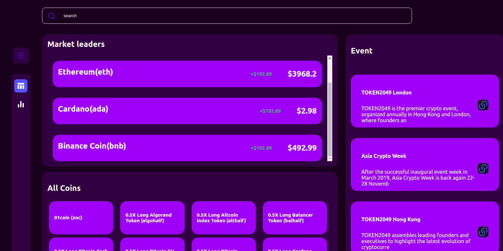

# DnarProject

> This is a sample project that fetches api from coinGecko and its built with reaccy



This app does the following:

- You can check for market leaders and current price of btc
- You can see all coin section that has coin and symbols
- The Event section shows latest events
- The graph section shows the demographic in real time
- There is an exchange section where currencies can be exchange with desired coin

## Built With

- Major languages: React, sass
- Technologies: coinGecko api, chartjs

## Live Demo

[Live Demo Link](https://dnar-project-nln9dqgv6-diamond-nicholas.vercel.app/)

## Getting Started\*

To get a local copy up and running follow these simple example steps.

### Install

You can download the code to your personal computer clonig the repository using the following command

```
git clone https://github.com/diamond-nicholas/dnarProject.git

```

You will also have to checkout to the homepage branch and use the command `git pull` to get the lastest code.

You also need to use the command `npm install` to install all packages from the project.

### Usage

- Open the `index.html` file inside the `dist` folder using your browser of choice.
- Or you can simple run `yarn start` or `npm start` on the terminal to load the project on your default browser on port:3000

## Authors

👤 **Nicholas Diamond**

- GitHub: [@Diamond](https://github.com/diamond-nicholas)
- LinkedIn: [Diamond Nicholas](https://www.linkedin.com/in/diamond-nicholas/)
- Twitter: [@diamondnich](https://twitter.com/diamondnich)

## 🤝 Contributing

Contributions, issues, and feature requests are welcome!

Feel free to check the [issues page](https://github.com/diamond-nicholas/dnarProject/issues).

## Show your support

Give a ⭐️ if you like this project!

## 📝 License

This project is [MIT](./LICENSE) licensed.
